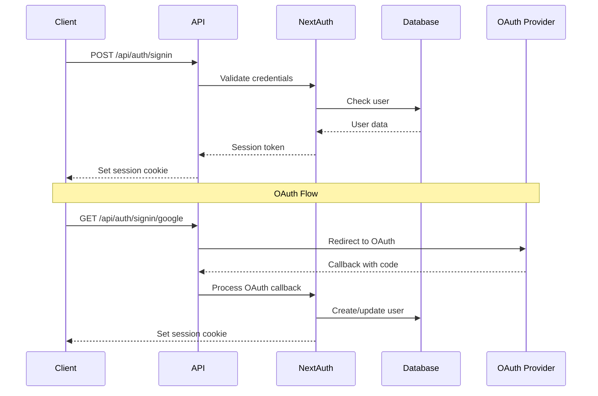

# API Documentation

## Overview

The Marketing Dashboard API is built with Next.js App Router and provides RESTful endpoints for managing authentication, dashboard data, clients, OAuth integrations, and reports.

## Base URL

- **Development**: `http://localhost:3000/api`
- **Production**: `https://your-domain.com/api`

## Authentication

All API endpoints (except authentication endpoints) require a valid session. The API uses NextAuth.js for session management with JWT tokens.

### Authentication Headers

```http
Cookie: next-auth.session-token=<session-token>
```

### Authentication Flow



## Error Responses

All API endpoints return standardized error responses:

```json
{
  "error": {
    "code": "VALIDATION_ERROR",
    "message": "Invalid input data",
    "details": {
      "field": "email",
      "issue": "Invalid email format"
    },
    "timestamp": "2024-01-15T10:30:00Z"
  }
}
```

### Error Codes

- `VALIDATION_ERROR` (400) - Input validation failed
- `UNAUTHORIZED` (401) - Authentication required
- `FORBIDDEN` (403) - Insufficient permissions
- `NOT_FOUND` (404) - Resource not found
- `RATE_LIMITED` (429) - Too many requests
- `INTERNAL_ERROR` (500) - Server error
- `INTEGRATION_ERROR` (502) - External API error

## Authentication Endpoints

### Sign In with Credentials

```http
POST /api/auth/signin
Content-Type: application/json

{
  "email": "user@example.com",
  "password": "password123"
}
```

**Response:**
```json
{
  "user": {
    "id": "user_123",
    "email": "user@example.com",
    "name": "John Doe"
  },
  "expires": "2024-02-15T10:30:00Z"
}
```

### Sign Up

```http
POST /api/auth/signup
Content-Type: application/json

{
  "email": "user@example.com",
  "password": "password123",
  "name": "John Doe"
}
```

**Response:**
```json
{
  "user": {
    "id": "user_123",
    "email": "user@example.com",
    "name": "John Doe"
  },
  "message": "Account created successfully"
}
```

### Get Session

```http
GET /api/auth/session
```

**Response:**
```json
{
  "user": {
    "id": "user_123",
    "email": "user@example.com",
    "name": "John Doe",
    "image": "https://example.com/avatar.jpg"
  },
  "expires": "2024-02-15T10:30:00Z"
}
```

### Sign Out

```http
POST /api/auth/signout
```

**Response:**
```json
{
  "message": "Signed out successfully"
}
```

## Dashboard Endpoints

### Get Dashboard Metrics

```http
GET /api/dashboard/metrics?startDate=2024-01-01&endDate=2024-01-31&platforms=google-ads,meta-ads
```

**Query Parameters:**
- `startDate` (required) - ISO date string
- `endDate` (required) - ISO date string
- `platforms` (optional) - Comma-separated list of platforms

**Response:**
```json
{
  "metrics": {
    "totalSpend": 15420.50,
    "totalImpressions": 1250000,
    "totalClicks": 45000,
    "totalConversions": 1200,
    "averageCPC": 0.34,
    "averageCTR": 3.6,
    "averageCPA": 12.85
  },
  "platformBreakdown": {
    "google-ads": {
      "spend": 8500.00,
      "impressions": 750000,
      "clicks": 27000,
      "conversions": 720
    },
    "meta-ads": {
      "spend": 6920.50,
      "impressions": 500000,
      "clicks": 18000,
      "conversions": 480
    }
  },
  "dateRange": {
    "startDate": "2024-01-01",
    "endDate": "2024-01-31"
  }
}
```

### Get Dashboard Alerts

```http
GET /api/dashboard/alerts
```

**Response:**
```json
{
  "alerts": [
    {
      "id": "alert_123",
      "type": "budget_exceeded",
      "severity": "high",
      "title": "Budget Exceeded",
      "message": "Google Ads campaign has exceeded daily budget",
      "platform": "google-ads",
      "campaignId": "campaign_456",
      "createdAt": "2024-01-15T10:30:00Z"
    }
  ],
  "count": 1
}
```

## Client Management Endpoints

### List Clients

```http
GET /api/clients?page=1&limit=10&search=acme
```

**Query Parameters:**
- `page` (optional) - Page number (default: 1)
- `limit` (optional) - Items per page (default: 10, max: 100)
- `search` (optional) - Search term

**Response:**
```json
{
  "clients": [
    {
      "id": "client_123",
      "businessName": "Acme Corp",
      "businessEmail": "contact@acme.com",
      "businessPhone": "+1-555-0123",
      "businessWebsite": "https://acme.com",
      "industry": "Technology",
      "status": "ACTIVE",
      "subscriptionPlan": "premium",
      "lastLoginAt": "2024-01-15T10:30:00Z",
      "createdAt": "2024-01-01T00:00:00Z"
    }
  ],
  "pagination": {
    "page": 1,
    "limit": 10,
    "total": 25,
    "pages": 3
  }
}
```

### Create Client

```http
POST /api/clients
Content-Type: application/json

{
  "businessName": "New Corp",
  "businessEmail": "contact@newcorp.com",
  "businessPhone": "+1-555-0456",
  "businessWebsite": "https://newcorp.com",
  "industry": "Healthcare",
  "subscriptionPlan": "basic"
}
```

**Response:**
```json
{
  "client": {
    "id": "client_456",
    "businessName": "New Corp",
    "businessEmail": "contact@newcorp.com",
    "status": "ACTIVE",
    "createdAt": "2024-01-15T10:30:00Z"
  },
  "message": "Client created successfully"
}
```

### Update Client

```http
PUT /api/clients/client_123
Content-Type: application/json

{
  "businessName": "Updated Corp",
  "subscriptionPlan": "premium"
}
```

**Response:**
```json
{
  "client": {
    "id": "client_123",
    "businessName": "Updated Corp",
    "subscriptionPlan": "premium",
    "updatedAt": "2024-01-15T10:30:00Z"
  },
  "message": "Client updated successfully"
}
```

### Delete Client

```http
DELETE /api/clients/client_123
```

**Response:**
```json
{
  "message": "Client deleted successfully"
}
```

## OAuth Integration Endpoints

### Start OAuth Flow

```http
POST /api/integrations/oauth/start
Content-Type: application/json

{
  "provider": "google-ads",
  "scopes": ["https://www.googleapis.com/auth/adwords"]
}
```

**Response:**
```json
{
  "authUrl": "https://accounts.google.com/oauth/authorize?client_id=...",
  "state": "secure_random_state_token"
}
```

### OAuth Callback

```http
GET /api/integrations/oauth/callback?code=auth_code&state=state_token&provider=google-ads
```

**Response:**
```json
{
  "integration": {
    "id": "integration_123",
    "platform": "GOOGLE_ADS",
    "accountId": "123-456-7890",
    "accountName": "Acme Ads Account",
    "isActive": true,
    "scopes": ["https://www.googleapis.com/auth/adwords"],
    "createdAt": "2024-01-15T10:30:00Z"
  },
  "message": "Integration connected successfully"
}
```

### Disconnect Integration

```http
POST /api/integrations/oauth/disconnect
Content-Type: application/json

{
  "integrationId": "integration_123"
}
```

**Response:**
```json
{
  "message": "Integration disconnected successfully"
}
```

### Get Integration Status

```http
GET /api/integrations/status
```

**Response:**
```json
{
  "integrations": [
    {
      "id": "integration_123",
      "platform": "GOOGLE_ADS",
      "accountName": "Acme Ads Account",
      "isActive": true,
      "syncStatus": "IDLE",
      "lastSyncAt": "2024-01-15T09:00:00Z",
      "lastError": null
    },
    {
      "id": "integration_456",
      "platform": "META_ADS",
      "accountName": "Acme Meta Account",
      "isActive": false,
      "syncStatus": "ERROR",
      "lastSyncAt": "2024-01-15T08:30:00Z",
      "lastError": "Token expired"
    }
  ]
}
```

### Sync Integrations

```http
POST /api/integrations/sync
Content-Type: application/json

{
  "platforms": ["google-ads", "meta-ads"],
  "force": false
}
```

**Response:**
```json
{
  "syncJobs": [
    {
      "platform": "GOOGLE_ADS",
      "status": "started",
      "jobId": "job_123"
    },
    {
      "platform": "META_ADS",
      "status": "started",
      "jobId": "job_456"
    }
  ],
  "message": "Sync jobs started successfully"
}
```

## Reports Endpoints

### List Reports

```http
GET /api/reports?page=1&limit=10&type=monthly
```

**Query Parameters:**
- `page` (optional) - Page number
- `limit` (optional) - Items per page
- `type` (optional) - Report type (weekly, monthly, custom)

**Response:**
```json
{
  "reports": [
    {
      "id": "report_123",
      "title": "Monthly Performance Report",
      "reportType": "MONTHLY",
      "startDate": "2024-01-01",
      "endDate": "2024-01-31",
      "emailSentAt": "2024-02-01T09:00:00Z",
      "createdAt": "2024-02-01T08:30:00Z"
    }
  ],
  "pagination": {
    "page": 1,
    "limit": 10,
    "total": 15,
    "pages": 2
  }
}
```

### Generate Report

```http
POST /api/reports
Content-Type: application/json

{
  "title": "Q1 Performance Report",
  "reportType": "CUSTOM",
  "startDate": "2024-01-01",
  "endDate": "2024-03-31",
  "platforms": ["google-ads", "meta-ads"],
  "metrics": ["spend", "impressions", "clicks", "conversions"],
  "sendEmail": true
}
```

**Response:**
```json
{
  "report": {
    "id": "report_456",
    "title": "Q1 Performance Report",
    "reportType": "CUSTOM",
    "startDate": "2024-01-01",
    "endDate": "2024-03-31",
    "createdAt": "2024-01-15T10:30:00Z"
  },
  "message": "Report generated successfully"
}
```

### Get Report

```http
GET /api/reports/report_123
```

**Response:**
```json
{
  "report": {
    "id": "report_123",
    "title": "Monthly Performance Report",
    "reportType": "MONTHLY",
    "startDate": "2024-01-01",
    "endDate": "2024-01-31",
    "data": {
      "summary": {
        "totalSpend": 15420.50,
        "totalImpressions": 1250000,
        "totalClicks": 45000,
        "totalConversions": 1200
      },
      "platformBreakdown": {
        "google-ads": { "spend": 8500.00 },
        "meta-ads": { "spend": 6920.50 }
      },
      "dailyMetrics": [
        {
          "date": "2024-01-01",
          "spend": 500.00,
          "impressions": 40000,
          "clicks": 1500,
          "conversions": 40
        }
      ]
    },
    "createdAt": "2024-02-01T08:30:00Z"
  }
}
```

## Rate Limiting

API endpoints are rate limited to prevent abuse:

- **Authentication endpoints**: 5 requests per minute per IP
- **General API endpoints**: 100 requests per minute per user
- **Data sync endpoints**: 10 requests per minute per user

Rate limit headers are included in responses:

```http
X-RateLimit-Limit: 100
X-RateLimit-Remaining: 95
X-RateLimit-Reset: 1642248000
```

## Webhooks

The API supports webhooks for real-time notifications:

### Webhook Events

- `integration.connected` - OAuth integration connected
- `integration.disconnected` - OAuth integration disconnected
- `integration.sync.completed` - Data sync completed
- `integration.sync.failed` - Data sync failed
- `report.generated` - Report generation completed

### Webhook Payload

```json
{
  "event": "integration.connected",
  "data": {
    "integrationId": "integration_123",
    "platform": "GOOGLE_ADS",
    "userId": "user_123"
  },
  "timestamp": "2024-01-15T10:30:00Z"
}
```

## SDK and Libraries

### JavaScript/TypeScript SDK

```bash
npm install @marketing-dashboard/sdk
```

```typescript
import { MarketingDashboardAPI } from '@marketing-dashboard/sdk';

const api = new MarketingDashboardAPI({
  baseUrl: 'https://your-domain.com/api',
  apiKey: 'your-api-key'
});

// Get dashboard metrics
const metrics = await api.dashboard.getMetrics({
  startDate: '2024-01-01',
  endDate: '2024-01-31'
});
```

## Testing

### API Testing

Use the provided test utilities for API testing:

```typescript
import { createTestClient } from '@/test-utils/api-client';

const client = createTestClient();
const response = await client.get('/api/dashboard/metrics');
expect(response.status).toBe(200);
```

### Postman Collection

Import the Postman collection for manual API testing:
- [Download Postman Collection](./postman/marketing-dashboard-api.json)

## Support

For API support and questions:
- Check the [troubleshooting guide](./TROUBLESHOOTING.md)
- Review error codes and messages
- Contact support with request/response details