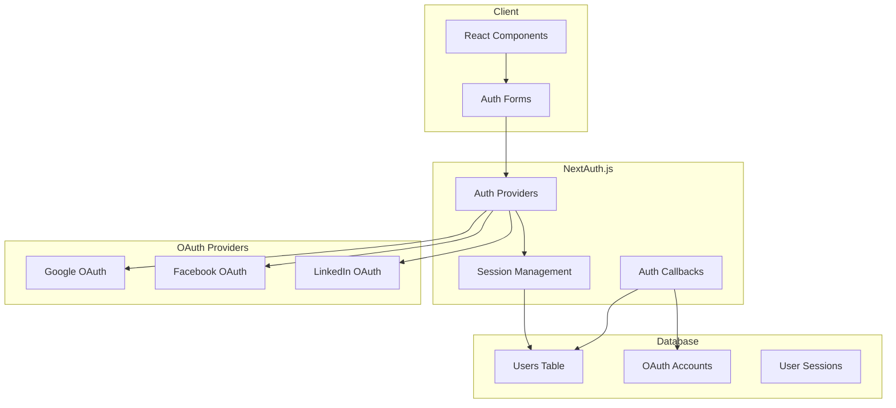

# Authentication Guide

This guide covers the authentication system implementation in the Marketing Dashboard, including OAuth providers, credential authentication, and session management.

## Overview

The application uses NextAuth.js for authentication with support for:
- **OAuth Providers**: Google, Facebook (Meta), LinkedIn
- **Credential Authentication**: Email/password with argon2id hashing
- **Session Management**: JWT-based sessions with secure cookies

## Architecture



## Configuration

### NextAuth.js Setup

The authentication configuration is in `lib/auth.ts`:

```typescript
import NextAuth from 'next-auth'
import GoogleProvider from 'next-auth/providers/google'
import FacebookProvider from 'next-auth/providers/facebook'
import LinkedInProvider from 'next-auth/providers/linkedin'
import CredentialsProvider from 'next-auth/providers/credentials'
import { PrismaAdapter } from '@next-auth/prisma-adapter'
import { prisma } from './prisma'
import { verifyPassword } from './auth-utils'

export const authOptions = {
  adapter: PrismaAdapter(prisma),
  providers: [
    GoogleProvider({
      clientId: process.env.GOOGLE_CLIENT_ID!,
      clientSecret: process.env.GOOGLE_CLIENT_SECRET!,
    }),
    FacebookProvider({
      clientId: process.env.FACEBOOK_CLIENT_ID!,
      clientSecret: process.env.FACEBOOK_CLIENT_SECRET!,
    }),
    LinkedInProvider({
      clientId: process.env.LINKEDIN_CLIENT_ID!,
      clientSecret: process.env.LINKEDIN_CLIENT_SECRET!,
    }),
    CredentialsProvider({
      name: 'credentials',
      credentials: {
        email: { label: 'Email', type: 'email' },
        password: { label: 'Password', type: 'password' }
      },
      async authorize(credentials) {
        if (!credentials?.email || !credentials?.password) {
          return null
        }

        const user = await prisma.user.findUnique({
          where: { email: credentials.email }
        })

        if (!user || !user.password) {
          return null
        }

        const isValid = await verifyPassword(credentials.password, user.password)
        if (!isValid) {
          return null
        }

        return {
          id: user.id,
          email: user.email,
          name: user.name,
          image: user.image
        }
      }
    })
  ],
  session: {
    strategy: 'jwt',
    maxAge: 30 * 24 * 60 * 60, // 30 days
  },
  callbacks: {
    async jwt({ token, user, account }) {
      if (user) {
        token.id = user.id
        token.role = user.role
      }
      return token
    },
    async session({ session, token }) {
      if (token) {
        session.user.id = token.id
        session.user.role = token.role
      }
      return session
    }
  },
  pages: {
    signIn: '/signin',
    signUp: '/signup',
    error: '/auth/error'
  }
}
```

### Environment Variables

Required environment variables for authentication:

```bash
# NextAuth.js
NEXTAUTH_URL="http://localhost:3000"
NEXTAUTH_SECRET="your-secret-key-here-minimum-32-characters-long"

# OAuth Providers
GOOGLE_CLIENT_ID="your-google-client-id"
GOOGLE_CLIENT_SECRET="your-google-client-secret"
FACEBOOK_CLIENT_ID="your-facebook-client-id"
FACEBOOK_CLIENT_SECRET="your-facebook-client-secret"
LINKEDIN_CLIENT_ID="your-linkedin-client-id"
LINKEDIN_CLIENT_SECRET="your-linkedin-client-secret"
```

## OAuth Provider Setup

### Google OAuth

1. **Create Google Cloud Project**
   - Go to [Google Cloud Console](https://console.cloud.google.com/)
   - Create new project or select existing
   - Enable Google+ API

2. **Create OAuth Credentials**
   - Go to Credentials section
   - Create OAuth 2.0 Client ID
   - Application type: Web application
   - Authorized redirect URIs: `{NEXTAUTH_URL}/api/auth/callback/google`

3. **Configure OAuth Consent Screen**
   - Add application name and logo
   - Add authorized domains
   - Configure scopes: `email`, `profile`

### Facebook OAuth

1. **Create Facebook App**
   - Go to [Facebook Developers](https://developers.facebook.com/)
   - Create new app
   - Choose "Consumer" app type

2. **Add Facebook Login**
   - Add Facebook Login product
   - Configure OAuth redirect URI: `{NEXTAUTH_URL}/api/auth/callback/facebook`
   - Enable email permission

3. **App Review** (for production)
   - Submit app for review
   - Request email permission
   - Provide privacy policy URL

### LinkedIn OAuth

1. **Create LinkedIn App**
   - Go to [LinkedIn Developers](https://www.linkedin.com/developers/)
   - Create new app
   - Verify company page

2. **Add Sign In with LinkedIn**
   - Add Sign In with LinkedIn product
   - Configure OAuth redirect URI: `{NEXTAUTH_URL}/api/auth/callback/linkedin`
   - Request r_liteprofile and r_emailaddress scopes

3. **App Verification**
   - Complete app verification process
   - Provide terms of service and privacy policy

## Credential Authentication

### Password Security

The application uses argon2id for password hashing:

```typescript
// lib/auth-utils.ts
import argon2 from 'argon2'

export async function hashPassword(password: string): Promise<string> {
  return await argon2.hash(password, {
    type: argon2.argon2id,
    memoryCost: 2 ** 16, // 64 MB
    timeCost: 3,
    parallelism: 1,
  })
}

export async function verifyPassword(password: string, hash: string): Promise<boolean> {
  try {
    return await argon2.verify(hash, password)
  } catch (error) {
    return false
  }
}
```

### Rate Limiting

Authentication endpoints are rate limited to prevent brute force attacks:

```typescript
// lib/utils/rate-limit.ts
import { NextRequest } from 'next/server'

const attempts = new Map<string, { count: number; resetTime: number }>()

export function checkRateLimit(request: NextRequest, maxAttempts = 5, windowMs = 15 * 60 * 1000) {
  const ip = request.ip || 'unknown'
  const now = Date.now()
  const userAttempts = attempts.get(ip)

  if (!userAttempts || now > userAttempts.resetTime) {
    attempts.set(ip, { count: 1, resetTime: now + windowMs })
    return { allowed: true, remaining: maxAttempts - 1 }
  }

  if (userAttempts.count >= maxAttempts) {
    return { allowed: false, remaining: 0, resetTime: userAttempts.resetTime }
  }

  userAttempts.count++
  return { allowed: true, remaining: maxAttempts - userAttempts.count }
}
```

## Session Management

### JWT Configuration

Sessions use JWT tokens with the following configuration:

```typescript
session: {
  strategy: 'jwt',
  maxAge: 30 * 24 * 60 * 60, // 30 days
  updateAge: 24 * 60 * 60, // 24 hours
},
jwt: {
  maxAge: 30 * 24 * 60 * 60, // 30 days
}
```

### Session Security

- **Secure Cookies**: HTTPS-only in production
- **SameSite**: Lax for OAuth compatibility
- **HttpOnly**: Prevents XSS attacks
- **Path**: Limited to application paths

### Session Validation

```typescript
// middleware.ts
import { withAuth } from 'next-auth/middleware'

export default withAuth(
  function middleware(req) {
    // Additional middleware logic
  },
  {
    callbacks: {
      authorized: ({ token, req }) => {
        // Check if user has required permissions
        return !!token
      },
    },
  }
)

export const config = {
  matcher: [
    '/dashboard/:path*',
    '/api/dashboard/:path*',
    '/api/clients/:path*',
    '/api/integrations/:path*',
    '/api/reports/:path*'
  ]
}
```

## Frontend Integration

### Session Provider

Wrap the application with the session provider:

```typescript
// src/app/layout.tsx
import { SessionProvider } from '@/components/auth/SessionProvider'

export default function RootLayout({ children }: { children: React.ReactNode }) {
  return (
    <html lang="en">
      <body>
        <SessionProvider>
          {children}
        </SessionProvider>
      </body>
    </html>
  )
}
```

### useAuth Hook

Custom hook for authentication state:

```typescript
// src/hooks/useAuth.ts
import { useSession } from 'next-auth/react'

export function useAuth() {
  const { data: session, status } = useSession()

  return {
    user: session?.user,
    isLoading: status === 'loading',
    isAuthenticated: !!session,
    isUnauthenticated: status === 'unauthenticated'
  }
}
```

### Protected Routes

Component for protecting routes:

```typescript
// src/components/auth/ProtectedRoute.tsx
import { useAuth } from '@/hooks/useAuth'
import { useRouter } from 'next/navigation'
import { useEffect } from 'react'

export function ProtectedRoute({ children }: { children: React.ReactNode }) {
  const { isAuthenticated, isLoading } = useAuth()
  const router = useRouter()

  useEffect(() => {
    if (!isLoading && !isAuthenticated) {
      router.push('/signin')
    }
  }, [isAuthenticated, isLoading, router])

  if (isLoading) {
    return <div>Loading...</div>
  }

  if (!isAuthenticated) {
    return null
  }

  return <>{children}</>
}
```

## Authentication Forms

### Sign In Form

```typescript
// src/components/auth/SignInForm.tsx
import { signIn } from 'next-auth/react'
import { useState } from 'react'
import { useForm } from 'react-hook-form'
import { zodResolver } from '@hookform/resolvers/zod'
import { signInSchema } from '@/lib/validation/auth.schemas'

export function SignInForm() {
  const [isLoading, setIsLoading] = useState(false)
  const { register, handleSubmit, formState: { errors } } = useForm({
    resolver: zodResolver(signInSchema)
  })

  const onSubmit = async (data: { email: string; password: string }) => {
    setIsLoading(true)
    try {
      const result = await signIn('credentials', {
        email: data.email,
        password: data.password,
        redirect: false
      })

      if (result?.error) {
        // Handle error
      } else {
        // Redirect to dashboard
      }
    } finally {
      setIsLoading(false)
    }
  }

  return (
    <form onSubmit={handleSubmit(onSubmit)}>
      <input
        {...register('email')}
        type="email"
        placeholder="Email"
        disabled={isLoading}
      />
      {errors.email && <span>{errors.email.message}</span>}

      <input
        {...register('password')}
        type="password"
        placeholder="Password"
        disabled={isLoading}
      />
      {errors.password && <span>{errors.password.message}</span>}

      <button type="submit" disabled={isLoading}>
        {isLoading ? 'Signing in...' : 'Sign In'}
      </button>

      <div>
        <button type="button" onClick={() => signIn('google')}>
          Sign in with Google
        </button>
        <button type="button" onClick={() => signIn('facebook')}>
          Sign in with Facebook
        </button>
        <button type="button" onClick={() => signIn('linkedin')}>
          Sign in with LinkedIn
        </button>
      </div>
    </form>
  )
}
```

## API Routes

### Authentication API

```typescript
// src/app/api/auth/signup/route.ts
import { NextRequest, NextResponse } from 'next/server'
import { prisma } from '@/lib/prisma'
import { hashPassword } from '@/lib/auth-utils'
import { signUpSchema } from '@/lib/validation/auth.schemas'
import { checkRateLimit } from '@/lib/utils/rate-limit'

export async function POST(request: NextRequest) {
  // Rate limiting
  const rateLimit = checkRateLimit(request)
  if (!rateLimit.allowed) {
    return NextResponse.json(
      { error: 'Too many attempts' },
      { status: 429 }
    )
  }

  try {
    const body = await request.json()
    const { email, password, name } = signUpSchema.parse(body)

    // Check if user exists
    const existingUser = await prisma.user.findUnique({
      where: { email }
    })

    if (existingUser) {
      return NextResponse.json(
        { error: 'User already exists' },
        { status: 400 }
      )
    }

    // Hash password
    const hashedPassword = await hashPassword(password)

    // Create user
    const user = await prisma.user.create({
      data: {
        email,
        name,
        password: hashedPassword
      }
    })

    return NextResponse.json({
      user: {
        id: user.id,
        email: user.email,
        name: user.name
      }
    })
  } catch (error) {
    return NextResponse.json(
      { error: 'Internal server error' },
      { status: 500 }
    )
  }
}
```

## Security Considerations

### Password Security

- **Argon2id**: Industry-standard password hashing
- **Salt**: Unique salt per password
- **Memory Cost**: 64MB memory usage
- **Time Cost**: 3 iterations
- **Parallelism**: Single thread

### Session Security

- **JWT Signing**: HS256 algorithm with secure secret
- **Token Expiry**: 30-day maximum age
- **Refresh**: Automatic token refresh
- **Revocation**: Server-side session invalidation

### OAuth Security

- **State Parameter**: CSRF protection
- **PKCE**: Code challenge for public clients
- **Scope Limitation**: Minimal required scopes
- **Redirect Validation**: Strict URI validation

### Rate Limiting

- **Authentication**: 5 attempts per 15 minutes
- **API Endpoints**: 100 requests per minute
- **IP-based**: Per-IP address tracking
- **Sliding Window**: Time-based reset

## Troubleshooting

### Common Issues

1. **OAuth Redirect Mismatch**
   - Verify redirect URIs in provider console
   - Check NEXTAUTH_URL environment variable
   - Ensure exact URL match (including protocol)

2. **Session Not Persisting**
   - Check NEXTAUTH_SECRET is set
   - Verify cookie settings
   - Check browser cookie storage

3. **Password Authentication Fails**
   - Verify password hashing implementation
   - Check database user record
   - Test password verification function

4. **Rate Limiting Issues**
   - Check IP address detection
   - Verify rate limit configuration
   - Clear rate limit cache if needed

### Debug Mode

Enable debug logging:

```bash
# Add to .env.local
NEXTAUTH_DEBUG=true
DEBUG="next-auth:*"
```

### Testing Authentication

```typescript
// __tests__/auth.test.ts
import { hashPassword, verifyPassword } from '@/lib/auth-utils'

describe('Password Security', () => {
  it('should hash and verify passwords correctly', async () => {
    const password = 'testpassword123'
    const hash = await hashPassword(password)
    
    expect(hash).not.toBe(password)
    expect(await verifyPassword(password, hash)).toBe(true)
    expect(await verifyPassword('wrongpassword', hash)).toBe(false)
  })
})
```

## Best Practices

1. **Environment Variables**
   - Use strong, unique secrets
   - Rotate secrets regularly
   - Never commit secrets to version control

2. **Password Policy**
   - Minimum 8 characters
   - Require mixed case, numbers, symbols
   - Prevent common passwords

3. **Session Management**
   - Use secure cookie settings
   - Implement proper logout
   - Handle session expiry gracefully

4. **OAuth Integration**
   - Request minimal scopes
   - Validate all OAuth responses
   - Handle OAuth errors gracefully

5. **Security Headers**
   - Implement CSP headers
   - Use HSTS in production
   - Enable XSS protection